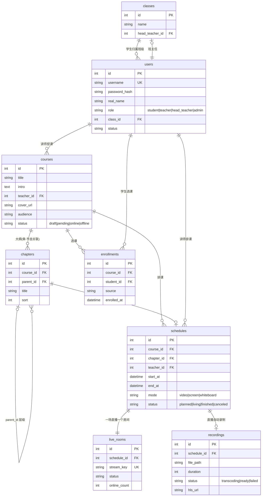
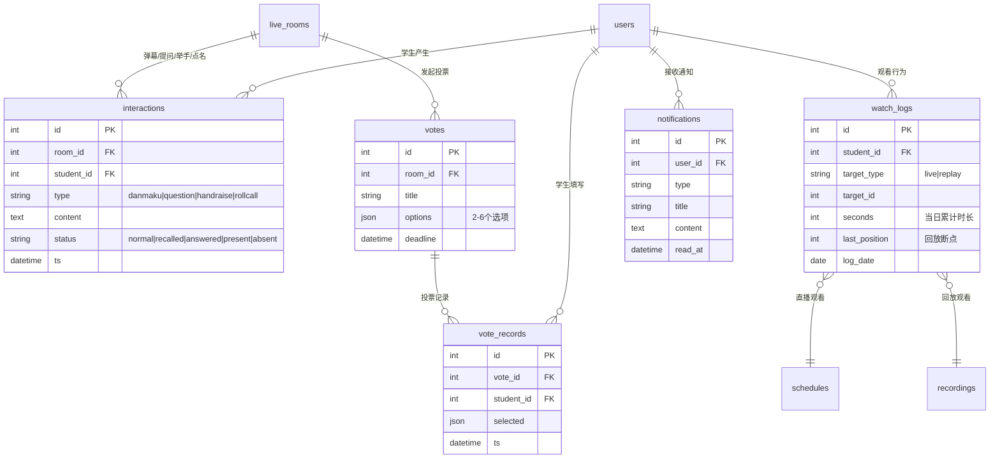
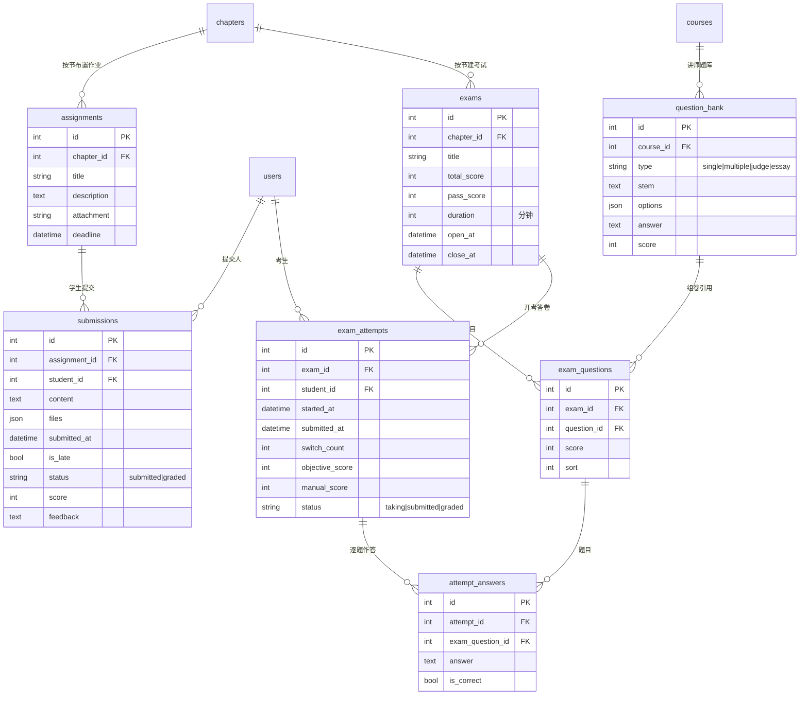
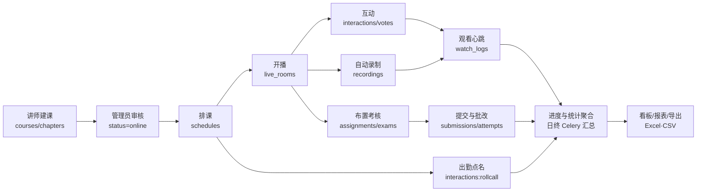

# 在线课堂直播平台 PRD（产品需求文档）

| 项目 | 内容 |
|---|---|
| 产品名称 | 教育机构在线课堂直播平台（Live_Sys） |
| 文档版本 | V1.0 |
| 编写日期 | 2026-09-19 |
| 技术约束 | 前端 Vue3，后端 Python 3.10，数据库 PostgreSQL，前后端分离 + RESTful API |

---

## 1. 产品概述

### 1.1 产品定位
面向教育机构的 B2B2C 在线课堂直播平台，覆盖「课程运营 → 直播授课 → 互动学习 → 录播回放 → 作业考核 → 数据统计」的完整教学闭环。

### 1.2 目标用户与角色
| 角色 | 说明 | 核心诉求 |
|---|---|---|
| 学生 | 在线学习者 | 看课表、进直播间、互动、交作业、看回放、看进度 |
| 讲师 | 授课教师 | 管理课程、开播授课、互动答疑、布置/批改作业与考试 |
| 班主任 | 教务监督者 | 监督班级学生的出勤、进度、成绩，发现学习异常 |
| 管理员 | 平台运营者 | 用户/角色管理、课程审核、全平台数据统计与导出 |

### 1.3 核心价值
- 对机构：教学全流程线上化，数据可量化、可导出、可考核。
- 对讲师：低门槛开播（音视频/屏幕共享/白板），互动工具齐备，作业批改高效。
- 对学生：实时互动课堂 + 录播补学 + 进度与成绩透明。

---

## 2. 角色权限矩阵（RBAC）

| 功能模块 | 学生 | 讲师 | 班主任 | 管理员 |
|---|---|---|---|---|
| 登录/改密 | ✓ | ✓ | ✓ | ✓ |
| 课程创建/编辑 | — | 仅本人课程 | — | 全部（含审核/下架） |
| 排课 | — | 仅本人课程 | — | 全部 |
| 开播/控流 | — | ✓（本人） | — | ✓（应急断流） |
| 观看直播/回放 | ✓（已选课） | ✓ | ✓（只读巡课） | ✓（只读） |
| 弹幕/提问/举手/投票 | ✓（参与） | ✓（发起/管理） | 只读旁观 | 只读旁观 |
| 作业/考试发布与批改 | 提交/答卷 | ✓（本人课程） | 只读查看 | 只读查看 |
| 学习进度 | 查看本人 | 查看选课学生 | 查看所辖班级 | 查看全部 |
| 统计报表/导出 | — | 本人课程维度 | 班级维度 | 全平台维度 |
| 用户与角色管理 | — | — | — | ✓ |

**数据范围原则**：接口层强制按角色过滤数据（越权访问返回 403），前端菜单按角色动态渲染。

---

## 3. 功能需求

### 3.1 用户登录与权限（P0）
- 账号密码登录，密码 bcrypt 加盐存储；连续 5 次失败锁定 10 分钟。
- JWT 鉴权：Access Token（2h）+ Refresh Token（7d），退出登录吊销 Refresh Token。
- 角色决定：登录后可见的菜单树、路由守卫、接口数据范围。
- 管理员可创建/禁用账号、分配角色、重置密码；讲师/班主任由管理员建档。
- 首次登录强制改密（管理员重置后）。

### 3.2 课程管理（P0）
- 课程字段：课程名、简介（富文本）、讲师、封面（图片上传 ≤2MB）、课程大纲（多级章节：章→节，支持排序）、适用人群、课程状态（草稿/待审核/已上线/已下架）。
- 讲师创建课程后提交管理员审核，审核通过方可排课与选课。
- 支持课程搜索（名称/讲师/状态）、分页列表。
- 学生选课：按课程或按班级批量分配学生到课程（选课关系是观看直播/回放的权限依据）。

### 3.3 直播排课（P0）
- 为课程的「节」安排直播：标题、计划开始/结束时间、直播间类型（视频直播/屏幕共享/白板）。
- 冲突检测：同一讲师/同一直播间时间段重叠时禁止保存。
- 学生课表视图：日/周视图展示已选课程的排课，状态标记（未开始/直播中/已结束/已取消）。
- 讲师/管理员可取消或改期直播，改期需通知已选课学生（站内消息）。
- 直播开始前 15 分钟生成开课提醒。

### 3.4 直播授课（P0）
- 讲师开播：摄像头+麦克风采集、屏幕共享、电子白板三种信号源，可切换。
- 学生观看：进入直播间实时观看，展示课程信息、在线人数。
- 电子白板：画笔/直线/矩形/文字/图片插入、多页白板、撤销/重做、清屏；白板操作以指令流广播（非视频流），回放时重放指令。
- 技术形态（MVP）：音视频走 WebRTC（讲师推流、学生拉流，SFU 采用 mediasoup 或 SRS + WHIP/WHEP），白板/弹幕等信令与数据走 WebSocket + REST。
- 直播间状态机：未开始 → 预热 → 直播中 → 已结束 →（录制转码中）→ 回放就绪。
- 断线重连：学生端自动重连拉流；讲师断流 60 秒内恢复可继续，超时提示结束或改期。
- 班主任/管理员可「巡课」进入任意直播间只读观看。

### 3.5 互动功能（P0/P1）
| 功能 | 优先级 | 需求 |
|---|---|---|
| 弹幕 | P0 | 学生发送文本弹幕（≤200 字），直播间滚动展示；讲师/管理员可撤回、禁言（单场或全平台）；敏感词过滤 |
| 提问 | P0 | 提问通道与弹幕分离，讲师端问题队列，可标记「已解答」；问答沉淀到课程 FAQ |
| 举手 | P0 | 学生举手进入等待队列，讲师可单人/多人连麦（可选，P1）或点名回答问题（文字上屏） |
| 点名 | P0 | 讲师发起点名，学生须在 60 秒内点击应答，结果记为出勤数据 |
| 投票 | P1 | 讲师发起单选/多选投票（标题+2~6 选项，限时），学生提交后实时饼图/柱状图展示统计 |

### 3.6 课程录播（P0）
- 直播开始即自动录制（服务端合流录制：主画面+共享屏），无需讲师操作。
- 直播结束后自动转码生成回放视频（HLS），挂到对应「课程节」下，状态：转码中/可播放。
- 回放权限 = 该节所属课程的已选课学生；支持倍速（0.75x/1x/1.25x/1.5x/2x）、断点续播（记忆上次观看位置）。
- 回放观看行为计入学习进度（有效观看时长，见 3.8）。
- 讲师可删除/重新生成回放；管理员可下载归档。

### 3.7 作业与考试（P1）
**作业**
- 讲师按课程节布置作业：标题、说明、附件（≤50MB）、截止时间、关联章节。
- 学生提交：文本 + 附件（多文件），截止前可重复提交（保留最终版本与历史版本）；逾期提交标记「补交」。
- 讲师批改：分数 + 文字/图片批注；批改后学生收到通知并查看。
- 未提交名单一览，支持一键催交（站内消息）。

**考试**
- 讲师组卷：题库按题型录入（单选/多选/判断/简答），或从已有题目勾选组成试卷；设置总分、及格线、考试时长、开考/截止时间。
- 学生在线答卷：倒计时、断线续考（答案实时暂存）、到时自动交卷。
- 客观题自动判分，主观题讲师人工批改；发布成绩后学生仅见本人成绩与解析（可配置）。
- 防作弊基础项：切屏次数记录（不作强制判负，仅记入监考日志）。

### 3.8 学习进度（P1）
- 跟踪维度：
  - 直播：出勤（进房记录）、点名应答、观看时长（心跳上报，每 30s 一次）。
  - 回放：有效观看时长、看完章节列表。
  - 作业：应交/已交/按时交/分数。
  - 考试：应考/已考/分数/是否及格。
- 课程进度条 = 已完成章节观看 ÷ 总章节；个人中心展示「我的课程进度」列表。
- 学生本人视图 + 讲师课程视图 + 班主任班级视图（同一数据三种范围）。

### 3.9 学习统计（P1）
- 指标：学习时长（日/周/月）、参与度（弹幕/提问/举手/点名应答/投票参与率）、作业完成率与平均分、考试及格率、章节完课率。
- 维度：按课程、按学生、按班级、按讲师。
- 图表：趋势折线（学习时长）、分布柱状（成绩分段 0-59/60-69/70-79/80-89/90-100）、雷达/条形（参与度构成）、排行（学习时长 Top）。

### 3.10 统计报表与导出（P1）
- 看板：管理员全平台看板（用户数、课程数、直播场次、开播时长、活跃学生数）；讲师课程看板；班主任班级看板。
- 明细表：学习时长明细、出勤明细、作业/成绩明细，支持筛选（时间范围/课程/班级/学生）。
- 导出：任意查询结果导出 Excel（.xlsx）与 CSV；导出当前页与导出全量两种；导出记录留痕（管理员可查）。

### 3.11 站内消息通知（P2）
- 事件：直播改期/取消、开课提醒、作业催交、批改完成、成绩发布、点名缺席。
- 顶部铃铛未读计数 + 消息列表。

---

## 4. 技术架构

### 4.1 总体架构（前后端分离）
```
浏览器(Vue3 SPA) ──HTTPS──> Nginx ──/api──> FastAPI(Python 3.10) ──> PostgreSQL 14+
        │                        └──/ws───> FastAPI WebSocket(弹幕/信令)
        └── WebRTC/SSE/FLV/HLS ──> 流媒体服务(SRS) ──> 对象存储/磁盘(录像文件)
                                         │
                                    录制转码 Worker(Celery + FFmpeg)
```

### 4.2 技术选型
| 层 | 选型 | 说明 |
|---|---|---|
| 前端 | Vue 3 + TypeScript + Vite + Pinia + Vue Router + Element Plus + ECharts | 组合式 API；路由守卫做权限；ECharts 做统计图表 |
| 后端 | Python 3.10 + FastAPI + SQLAlchemy 2.x + Pydantic v2 + Alembic | 原生 async 与 WebSocket 支持，自动生成 OpenAPI 文档 |
| 鉴权 | python-jose(JWT) + passlib(bcrypt) | RBAC 依赖注入式权限校验 |
| 数据库 | PostgreSQL 14+ | 主数据存储 |
| 缓存/队列 | Redis + Celery | 转码任务、心跳聚合、Token 黑名单、在线人数 |
| 直播 | SRS 6（WebRTC/HTTP-FLV/HLS）+ FFmpeg | 讲师 WHIP 推流、学生 WebRTC 或 HLS 拉流；SRS 录制到磁盘 |
| 实时信令 | WebSocket（FastAPI） | 弹幕、举手、投票、白板指令流 |
| 导出 | openpyxl（xlsx）+ csv 标准库 | 流式下载 |
| 部署 | Docker Compose | nginx/api/worker/db/redis/srs 六服务 |

### 4.3 RESTful API 设计约定
- 前缀 `/api/v1`，资源复数名词，分页 `?page=1&size=20`，排序 `?sort=-created_at`。
- 统一响应：`{ "code": 0, "message": "ok", "data": {...} }`；HTTP 状态码表达鉴权/资源错误（401/403/404/409/422）。
- 错误码分段：1xxxx 通用、2xxxx 认证权限、3xxxx 课程排课、4xxxx 直播、5xxxx 作业考试、6xxxx 统计导出。
- 核心端点示例：

| 模块 | 方法与路径 |
|---|---|
| 认证 | POST /auth/login · POST /auth/refresh · POST /auth/logout · GET /auth/me |
| 用户 | GET/POST /users · PUT /users/{id}/roles · PUT /users/{id}/status · POST /users/{id}/reset-password |
| 课程 | GET/POST /courses · GET/PUT/DELETE /courses/{id} · POST /courses/{id}/submit-review · PUT /courses/{id}/review · PUT /courses/{id}/chapters · POST /courses/{id}/enroll |
| 排课 | GET/POST /schedules · PUT/DELETE /schedules/{id} · GET /schedules/timetable |
| 直播 | POST /rooms/{id}/start · POST /rooms/{id}/stop · GET /rooms/{id} · WS /ws/rooms/{id} |
| 互动 | WS 通道（danmaku/raise/hand/vote/call-roll）· POST /votes · GET /votes/{id}/result |
| 录播 | GET /recordings?schedule_id= · GET /recordings/{id}/playlist (HLS) · PUT /recordings/{id}/watch-position |
| 作业 | POST /assignments · POST /assignments/{id}/submissions · PUT /submissions/{id}/grade |
| 考试 | POST /exams · POST /exams/{id}/questions · POST /exams/{id}/attempts/start · PUT /attempts/{id}/answer · POST /attempts/{id}/submit · PUT /attempts/{id}/grade |
| 进度 | GET /me/progress · GET /courses/{id}/progress · GET /classes/{id}/progress |
| 统计 | GET /stats/overview · GET /stats/courses/{id} · GET /stats/students/{id} · GET /stats/export (format=xlsx\|csv) |

### 4.4 数据模型（PostgreSQL 核心表）
```
users(id, username, password_hash, real_name, role, class_id?, status, ...)
classes(id, name, head_teacher_id)                        -- 班级/班主任
courses(id, title, intro, teacher_id, cover_url, audience, status, ...)
chapters(id, course_id, parent_id, title, sort)           -- 大纲树
enrollments(id, course_id, student_id, source, enrolled_at)
schedules(id, course_id, chapter_id, teacher_id, start_at, end_at, mode, status, room_id)
live_rooms(id, schedule_id, stream_key, status, ...)
interactions(id, room_id, student_id, type[danmaku|question|handraise|rollcall|vote], content, status, ts)
votes(id, room_id, title, options_json, deadline) / vote_options / vote_records
recordings(id, schedule_id, file_path, duration, status[转码中|就绪|失败], hls_url)
watch_logs(id, student_id, target_type[live|replay], target_id, seconds, last_position, date)
assignments(id, chapter_id, title, description, attachment, deadline) / submissions(id, assignment_id, student_id, content, files, submitted_at, is_late, status, score, feedback)
question_bank(id, course_id, type, stem, options_json, answer, score) / exam_questions
exams(id, chapter_id, title, total_score, pass_score, duration, open_at, close_at) / exam_attempts(id, exam_id, student_id, started_at, submitted_at, switch_count, objective_score, manual_score, status)
notifications(id, user_id, type, title, content, read_at)
export_logs(id, user_id, report_type, params_json, file_path, created_at)
```
进度类指标（watch_logs 等）按天分区预留，量大时聚合表 + Celery 定时汇总。

### 4.5 业务流程 ER 图

#### 4.5.1 主数据链路（用户 → 课程 → 排课 → 直播 → 录播）



#### 4.5.2 互动与学习行为链路（直播互动 → 观看时长 → 进度）



#### 4.5.3 考核与成绩链路（作业 → 题库 → 考试 → 成绩）



#### 4.5.4 业务主流程（数据流转视角）



**关键业务规则在 ER 上的体现**：
- 观看权限：`enrollments` 是直播/回放/进度统计的准入依据（学生 × 课程多对多）。
- 一场排课（`schedules`）1:1 对应直播间与录播文件，是互动、出勤、回放的数据锚点。
- `watch_logs` 以「学生 × 目标 × 自然日」为最细粒度，统计层按天聚合，支撑 3.9 的时长与完课率指标。
- 成绩双轨：`submissions.score`（作业）与 `exam_attempts.objective_score + manual_score`（考试），班主任/管理员视图只读本链路。

## 5. 非功能需求
| 项 | 指标 |
|---|---|
| 并发 | 单直播间支持 ≥300 人观看；全平台 ≥2000 并发在线（MVP 验收线） |
| 延迟 | WebRTC 拉流 <1s；HLS 备用链路 <10s；弹幕端到端 <500ms |
| 性能 | API P95 <300ms（统计聚合类 <1.5s）；页面首屏 <2s |
| 安全 | HTTPS 全站；JWT + 接口级 RBAC；SQL 参数化（ORM）；上传文件类型/大小白名单；XSS 过滤（弹幕/富文本）；操作审计日志 |
| 可用性 | 直播中断自动恢复；录制失败可人工重触发转码；每日数据库备份 |
| 兼容性 | Chrome/Edge 最新两个大版本；1366×768 以上分辨率 |

## 6. 验收里程碑
| 阶段 | 范围 | 周期建议 |
|---|---|---|
| M1 | 登录鉴权 + RBAC + 课程管理 + 排课课表 | 第 1–3 周 |
| M2 | 直播授课（音视频/屏幕共享）+ 录制回放 + 弹幕/提问/举手/点名 | 第 4–7 周 |
| M3 | 电子白板 + 投票 + 作业考试全流程 | 第 8–10 周 |
| M4 | 学习进度 + 统计看板 + 报表导出 + 消息通知 | 第 11–13 周 |
| M5 | 压测调优、安全加固、UAT | 第 14 周 |

## 7. 风险与对策
| 风险 | 影响 | 对策 |
|---|---|---|
| WebRTC 服务器端部署/网络穿透复杂 | 直播延期 | MVP 允许「HTTP-FLV/HLS 低配链路」先行，WebRTC 二期优化；用 SRS 官方 Docker 镜像降低部署成本 |
| 白板指令流与视频回放不同步 | 回放体验差 | 白板指令统一打服务器时间戳，回放按时间轴重放 |
| 心跳时长数据被刷 | 统计失真 | 服务端校验页面可见性（visibilitychange）+ 单场时长上限告警 |
| 转码任务堆积 | 回放延迟发布 | Celery 独立 worker 队列 + 失败重试 + 状态可查 |

## 8. 范围外（本期不做）
- 移动端 App（Web 响应式兼容即可）；付费/交易；AI 字幕与实时翻译；多人连麦复杂混流（保留 P2 接口预留）；直播美颜/虚拟背景。
